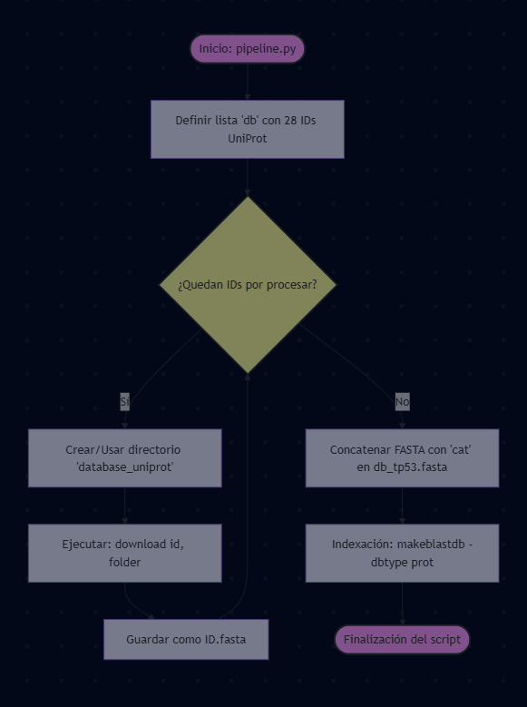

## Pipeline TP53

### 1. Configuración Inicial y Descarga de Base de Datos
- **Inicio**: El script `pipeline.py` comienza con la configuración de las listas de proteínas a descargar.
- **Base de Datos**: Se define una lista `db` con 28 identificadores UniProt (IDs) de proteínas relacionadas con TP53.
- **Descarga Masiva**: Se ejecuta un bucle que itera sobre cada ID de la lista `db`.
    - Se crea un directorio `database_uniprot` para almacenar los archivos.
    - Se llama a la función `download(id, folder)` que descarga la secuencia en formato FASTA desde UniProt y la guarda como `[ID].fasta` en el directorio especificado.
- **Concatenación**: Se concatena todos los archivos FASTA de la base de datos en un solo archivo `database_uniprot/db_tp53.fasta` usando `cat`.
- **Indexación (makeblastdb)**: Se ejecuta el comando `makeblastdb` para crear una base de datos binaria optimizada para búsquedas rápidas. Esta base de datos se nombra `database_uniprot/db_tp53` y está configurada como `dbtype prot` (proteínas).
- **Finalización**: El script finaliza

